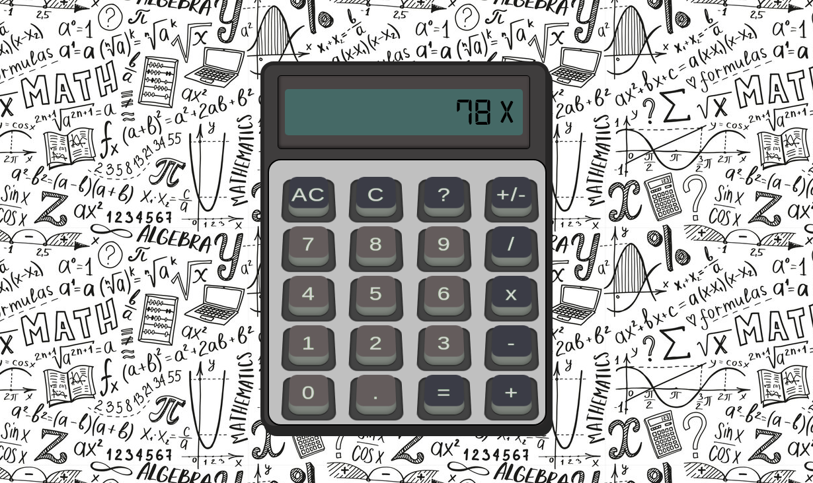

# The Calculator

[Live Demo](https://innopaolo.github.io/calculator/)

A web-based calculator application that allows you to perform basic mathematical calculations. The 'AC' button clears the screen, and the 'C' button deletes the last digit entered. The "+/-" button allows you to toggle the sign of the number. Enjoy some childhood nostalgia by clicking the "?" button.

Feel free to explore the code and make any improvements or modifications as needed. If you have any questions or suggestions, please don't hesitate to reach out.

Happy calculating!

